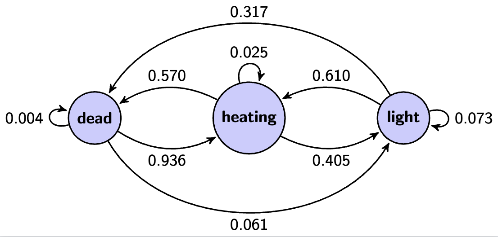

# flickering-neon-lamp
This repository contains Markov chain model for flickering neon lamp.


## Why?
Back in the days when I was still at the student dorm I had neon lamp in our kitchen. The lamp got broken and started to flicker. I was wondering if I could model this behaviour. I recorded 10 min video of the lamp and after a few years I got the time to process it over one night. 

## How to run
Install dependencies
```bash
pip install -r requirements.txt
```
All code is in 
- `poisson.ipynb` 
- `mchain_2.ipynb`
- `mchain_3.ipynb`

## Discussion

My initial assumption was that the process is Poisson process. I tried to fit the data to Poisson distribution. The results are in `poisson.ipynb`. It is clear that the data does not fit Poisson distribution.

I tried to fit the data to Markov chain with 2 states. The first state is dead (d) and the second is light (l). The results are in `mchain_2.ipynb`. With such a simple model we are able to explain the majority of measured data. I didn't see this as a satisfactory result. 

I tried to fit the data to Markov chain with 3 states. The first state is dead (d) the second state is heating (h) and the third state is light (l). The results are in `mchain_3.ipynb`. The results are better but still not perfect. I think that the model with 3 states is the best model for this data.



## Conclusion

I was able to model the flickering neon lamp with Markov chain with 3 states. In future, I would like to include a memory kernel to the model. I think that the memory kernel would be a promising approach to this problem.

## Whole video on YT
[](https://youtu.be/YdJjT4DGCh4)
