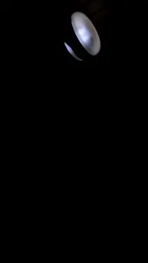

# flickering-neon-lamp
This repository contains Markov chain model for flickering neon lamp.



## Why?
Back in the days when I was still at studern dorm I had neon lamp in our kitchen. The lamp got broken and started to flicker. I was wondering if I can model this behavior. I recorded 10 min video of the lamp and after few years I got the time to process it over one night. 

## How to run
Install dependencies
```bash
pip install -r requirements.txt
```

## Whole video on YT
[](https://youtu.be/YdJjT4DGCh4)
